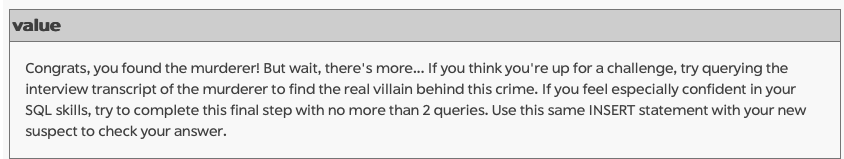
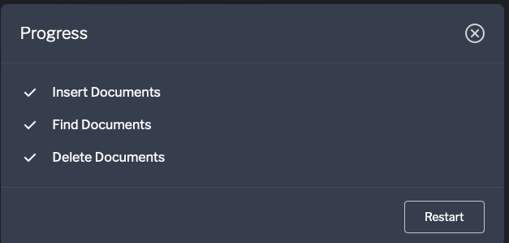
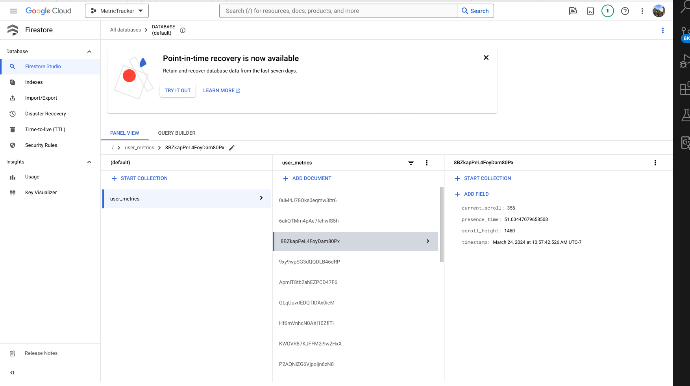
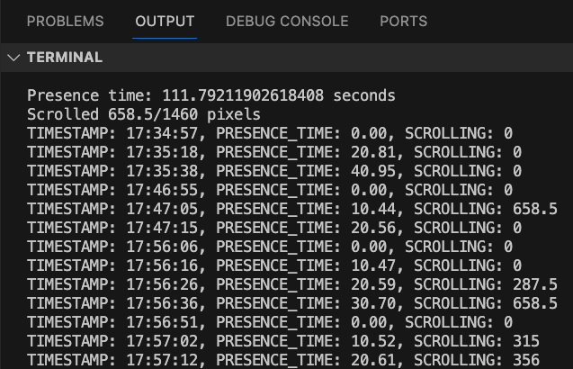

# Metric Tracker with Database

Time spent: 6 hours total

## Features
The following **required** features are completed:
- [x] Organize Github projects for Assignment 3 (2 pts)
- [x] Complete SQL Mystery Walkthrough and take a screenshot or print to PDF the
webpage (2 pts)
- [x] Complete Interactive MongoDB Tutorial and take a screenshot or print to PDF
the webpage (2 pts)
- [x] Choose a SQL or NoSQL Database and set up a server (4 pts)
- [x] Modify your metric_tracker file so that the metrics are saved onto a database
(5 pts)
The following **bonus** features are implemented:
- [x] Retrieve values from the database (1 pt).
- [x] Create separate Tables (SQL) or Documents (NoSQL) for each metric and relate
them via user (2 pt).

## Images

